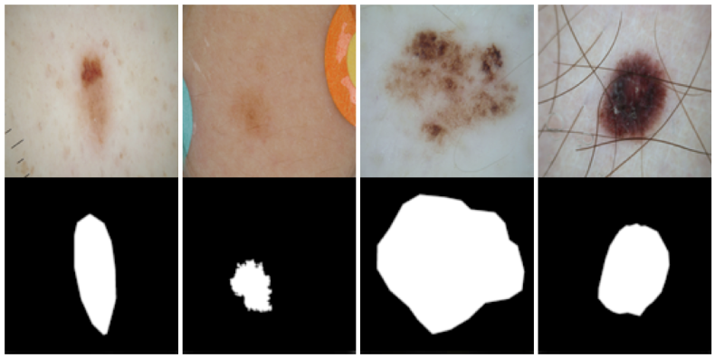
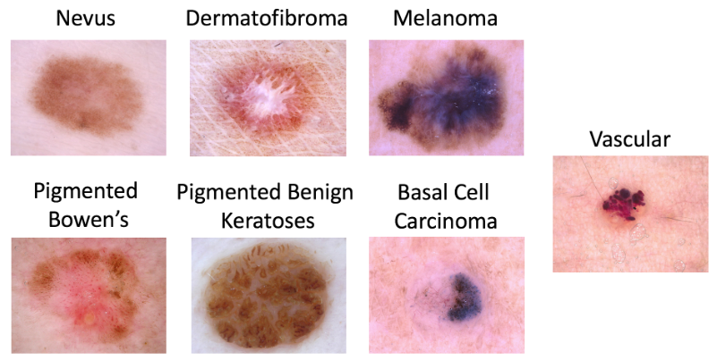

# Two stage Framework for Skin Lesion Segmentation and Classification

One of the most common types of human malignancies is skin cancer, which is chiefly diagnosed visually, initiating with a clinical screening followed by dermoscopic analysis, histopathological assessment, and a biopsy. According to the high similarity between melanoma and nevus lesions, physicians take much more time to investigate these lesions. The automated classification of skin lesions will save 
effort, time and human life. This repo gives algorithm for automated classification of skin lesion with help of segmentation.

## Dataset:

For segmentation, ISIC 2018 Task 1 dataset is used consisting of around 2600 training images. Link to download is https://challenge2018.isic-archive.com/task1/training.

For the classification dataset, HAM10000 is used which is available at https://dataverse.harvard.edu/dataset.xhtml?persistentId=doi:10.7910/DVN/DBW86T. This dataset consists of around 10000 images as shown in table below.
| Disease | Number of images | 
| :---: | :---: |
|akiec | 327 |
| bcc | 514 |
|bkl | 327 |
| df | 514 |
| mel | 327 |
| nv | 514 |
| vasc | 327 |

## Segmentation Framework
  ### -- Training
To train the segmentation data, following code can be used: > 'main.py'

## Classification Framework
  ### -- Training
Before training the data, first we perform the preprocessing and separate the data classwise.
To train the classification data, following code can be used: > 'model.py'

  ### -- Evaluation
To evaluate the classifciation model, following code can be used: > 'evaluate.py'

## Citation
[1] Noel C. F. Codella, David Gutman, M. Emre Celebi, Brian Helba, Michael A. Marchetti, Stephen W. Dusza, Aadi Kalloo, Konstantinos Liopyris, Nabin Mishra, Harald Kittler, Allan Halpern: “Skin Lesion Analysis Toward Melanoma Detection: A Challenge at the 2017 International Symposium on Biomedical Imaging (ISBI), Hosted by the International Skin Imaging Collaboration (ISIC)”, 2017; arXiv:1710.05006.

[2] Tschandl, P., Rosendahl, C. & Kittler, H. The HAM10000 dataset, a large collection of multi-source dermatoscopic images of common pigmented skin lesions. Sci. Data 5, 180161 doi:10.1038/sdata.2018.161 (2018).
